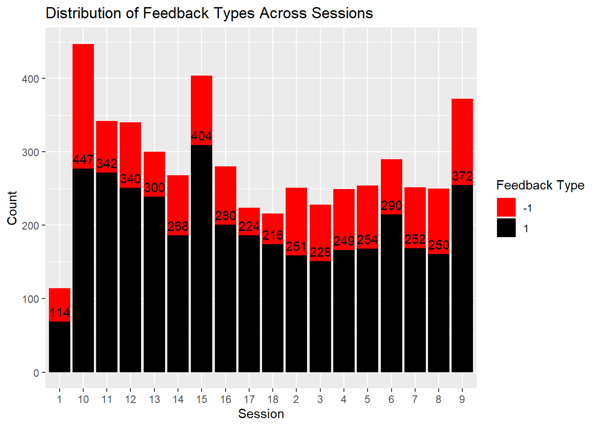

# NeuralDecisionPredict
Analytical models predicting mouse trial outcomes from neural activity. Aims to correlate visual cortex signals to decision-making behavior, enhancing neuroscientific understanding.

# Exploring the Relationship between Neural Activity and Feedback Types in Mouse Decision-Making

## Overview
This project investigates the intricate relationship between neural activity and decision-making in mice. Through a series of analyses and predictive modeling, we aim to gain insights into how neural responses correlate with feedback types during decision-making tasks.

## Data Analysis
The data set, originally collected by Steinmetz, includes 18 sessions that provide a comprehensive view of the neural activity within the visual cortex of mice. The analysis is divided into three main parts:

### Part 1: Exploratory Data Analysis

- Examination of neural activities during trials.
- Investigation of changes across trials.
- Analysis of homogeneity and heterogeneity across sessions and mice.

### Part 2: Data Integration

- Identification of shared patterns across sessions.
- Addressing differences between sessions to enhance prediction performance.

### Part 3: Predictive Modeling
- Development of a model to predict trial outcomes.
- Evaluation of the model's performance on two test sets from Session 1 and Session 18.

## Results
The results from this study are expected to contribute to a better understanding of the experimental data and provide valuable insights for future research in the field.

## Repository Contents
- `Data files`: Contains the raw data and processed data sets.
- `Scripts`: Includes all the code used for analysis and modeling.
- `Figures`: All generated charts and visualizations from the analysis.
- `Documentation`: Detailed explanation of methods and findings.

## Usage
To replicate the analysis or to apply the predictive model to new data, follow the instructions provided in the `scripts` directory.

## Contributing
Contributions to this project are welcome. Please refer to the contributing guidelines before making pull requests.

## License
This project is licensed under the MIT License - see the `LICENSE` file for details.

## Acknowledgments
- Special thanks to Steinmetz for providing the initial data set.
- Appreciation to all contributors and reviewers for their insights and feedback.
